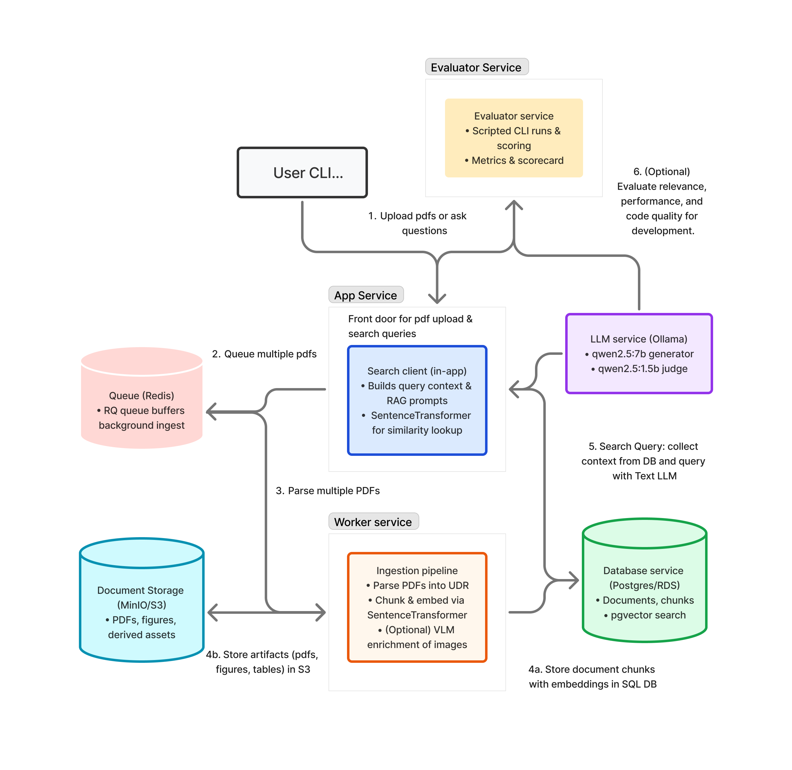

# Smart Doc Agent

Smart Doc Agent ingests research PDFs, builds retrieval-ready knowledge, and provides a RAG-powered query interface that blends embeddings, a vector database, and LLM search. 



## 1. Evaluator Design & Metrics-Driven Development

Our evaluator profile spins up the docker stack, replays curated question fixtures, and judges answers with a warm-started `qwen2.5:1.5b` critic so we catch regressions fast.

### 1b. Agent Reflection Matters
We route every answer through an AI reflection loop: the text LLM drafts a reply, the lightweight judge critiques it, and we feed the judge’s rationale back into development. Alongside answer accuracy, we iterate on parsing speed and code quality every run, so regressions in ingestion throughput or maintainability show up as fast as reasoning slips. This pattern surfaces subtle issues without human review, keeps the 1.5B judge resident for snappy feedback, and gives precise deltas whenever we tweak retrieval or chunking.

### 1a. Metrics We Track Every Run
- `overall_score`: single 0–1 gate derived from scenario weights
- `contextual_judge_pass_rate`: ratio of answers scoring ≥0.6 with LLM judge
- `context_similarity_avg` & `baseline_similarity_avg`: retrieval lift from adding context
- `runtime_seconds`: wall-clock duration, tracked for perf drift
- `generation_failures`: counts LLM or pipeline exceptions we need to triage

## 2. System Design Overview

### 2a. High-Level Component Roles
- `Evaluator service`: optional harness container that kicks off scripted CLI sessions, captures responses, and persists scorecards plus judge rationales. This helps us evaluate our code and system changes as we build the system.
- `App service (CLI / API)`: front-door container for uploading PDFs and launching searches; houses the production search client that mirrors user and evaluator traffic.
- `Search client (in-app)`: component inside the app container that embeds queries with the in-process SentenceTransformer, retrieves top-k chunks, and assembles the RAG prompt before calling the generator.
- `Redis service`: buffers ingestion bursts via an RQ queue so workers can scale horizontally without backpressure.
- `Worker service`: pulls queued ingest jobs, runs the ingestion pipeline (including in-container SentenceTransformer embeddings), and reports status/telemetry back to the app; not involved in live query serving.
- `Ingestion pipeline`: module inside the worker that parses PDFs into UDR, chunks text, generates embeddings, and (optionally) enriches figures/tables with a VLM before persisting artifacts.
- `Postgres service`: authoritative store for documents, chunks, artifacts, evaluation metrics, and job logs with pgvector embedding indices powering similarity retrieval.
- `MinIO service`: S3-compatible blob storage for original PDFs, extracted images, and other large assets referenced from Postgres.
- `Ollama service`: hosts the text generator (`qwen2.5:7b`) and lightweight judge (`qwen2.5:1.5b`) for RAG answers and reflection.

### 2b. Chunking → Embedding → Retrieval → RAG
1. **Chunking**: adaptive splitter builds page-aware segments, tagging tables, figures, and narrative blocks.
2. **Embedding**: each chunk gets a 384-dim vector via `BAAI/bge-small-en-v1.5`, recorded in Postgres’ `vector` column.
3. **Similarity Retrieval**: HNSW index surfaces the top-k neighbors; filters pin by section type when needed.
4. **RAG Final Query**: retrieved chunks flow into the `qwen2.5:7b` generator with system prompts tuned for citations; outputs are stored alongside judge rationales for replay.

### 2c. PDF Parser & UDFs
- `agent.ingestion.pdf_parser` wraps PyMuPDF, pdfplumber, and `pypdf` to emit a `UnifiedDocumentRepresentation (UDR)` that our ingestion UDFs expect, carving pages into blocks/spans, tagging sections, and normalizing citations, captions, and metadata.
- Parser feature flags (`ParseOptions`) toggle PaddleOCR layout analysis, reference clustering, and figure/table detectors; they also enable OCR fallback plus a Qwen-VL enrichment path that renders crops so we can extract structured table cells or figure summaries when needed.
- A Postgres trigger (`update_documents_updated_at`) keeps timestamps fresh, while SQL UDFs offer reusable building blocks for downstream analytics (e.g., `uuid_generate_v4`, `update_updated_at_column`).

### 2d. SQL Schema Snapshot
```
documents(id PK, filename, title, authors[], abstract, s3_key, pdf_hash UNIQUE,
	   num_pages, processing_status, udr_data JSONB, timestamps)
chunks(id PK, document_id→documents, content, chunk_index, page_number,
	embedding vector(384), metadata JSONB)
artifacts_index(id PK, document_id→documents, artifact_type, caption,
		  structured_data JSONB, s3_key)
eval_results(id PK, document_id→documents, metric_name, metric_value,
	      dataset, model_name, table_reference, metadata JSONB)
```

- `documents` is the canonical catalog: every ingest step lands metadata, hashes, and the serialized UDR snapshot here so we can reproduce parsing decisions. The `processing_status` flag tracks ingestion progress (`queued`, `processed`, `failed`), while `pdf_hash` prevents duplicate uploads.
- `chunks` stores retrieval-ready text segments; the `embedding` column uses pgvector (384 dims) and lines up with the in-memory FAISS index used by workers. `metadata` carries provenance such as section labels or figure references.
- `artifacts_index` keeps table/figure derivatives that we can surface in downstream UIs. Each entry points back to S3 for the rendered artifact and carries structured payloads (e.g., CSV-normalized tables).
- `eval_results` records offline evaluation metrics. Jobs insert per-document scores with enough context (`dataset`, `model_name`, `table_reference`) to slice quality over time and reconcile with A/B test runs.

## 3. Install & Run

### Requirements
- Docker Desktop 4.28+ (or Docker Engine 24+ with Compose V2)
- 16+ GB RAM recommended for simultanous Ollama + workers
- Python 3.11 (optional) if you plan to run utility scripts locally

### Quickstart
```bash
git clone https://github.com/brucegarro/smart-doc-agent.git
cd smart-doc-agent
cp .env.example .env        # adjust MinIO/Ollama creds if needed

# Build containers and pull Ollama models declared in compose
docker compose build

# Run end-to-end evaluator (spins up DB, MinIO, Redis, Ollama, workers)
docker compose --profile eval up --abort-on-container-exit --exit-code-from evaluator
```

Scorecards land under `eval/results/<run_id>/scorecard.json` and summary rows enter the `eval_results` table. Inspect logs with `docker compose --profile eval logs evaluator` or explore the database via `psql` using the connection info in `.env`.

### Day-to-Day Workflow
- `docker compose up app worker` to expose the CLI/API while workers process ingestion queues.
- `python src/agent/cli.py ingest sample_papers/*.pdf` (inside the `app` container) to queue new documents.
- Re-run the evaluator whenever retrieval logic changes to keep quality bars honest.

